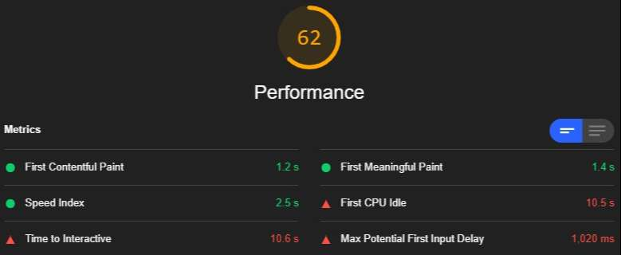
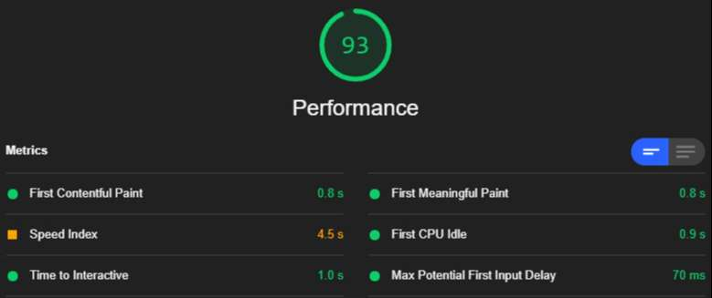

# 🔌⚡ Nuxt Prune HTML

[![Code Quality][quality-src]][quality-href]
[![Dependencies][dependencies-src]][dependencies-href]
[![Version][npm-version-src]][npm-version-href]

[quality-src]: https://img.shields.io/badge/code%20quality-A-informational?style=flat
[quality-href]: https://luxdamore.github.io/nuxt-prune-html/

[dependencies-src]: https://img.shields.io/badge/dependencies-up%20to%20date-darkgreen.svg?style=flat
[dependencies-href]: https://npmjs.com/package/@levgenij/nuxt-prune-html

[npm-version-src]: https://img.shields.io/npm/v/@levgenij/nuxt-prune-html/latest.svg?style=flat&color=darkorange&label=version
[npm-version-href]: https://npmjs.com/package/@levgenij/nuxt-prune-html

> **Fork of [LuXDAmore/nuxt-prune-html](https://github.com/LuXDAmore/nuxt-prune-html)**

> Nuxt module to prune html before sending it to the browser (it removes elements matching CSS selector(s)), useful for boosting performance showing a different HTML for bots/audits by removing all the scripts with dynamic rendering.

> ⚠️ **Important**: This module has been **completely rewritten for Nuxt 3+** and is **no longer compatible with Nuxt 2**. 
> - For **Nuxt 2**, please use version `2.x` of this module
> - For **Nuxt 3+**, use version `3.x` (current version)

## 💘 Motivation

Due to the versatility of Nuxt (and of the SSR in general), a website generated (or served) via node server, has everything it needs already injected in the HTML (ex. *css styles*). So, usually, for a bot, a audit or for a human, the website its almost visually the same with or without Javascript.

This library is born to remove all the scripts injected into the HTML **only** if a visitor is a **Bot** or a **Performance Audit** (ex. *a Lighthouse Audit*).
This should **speed up** (**blazing fast**) your *nuxt-website* up to a value of **~99** in **performance** because it [cheats various scenarios](https://web.dev/lighthouse-performance/).

Usually, with **less assets, resources and html** to download, the number of urls crawled by a bot are **widely boosted** 📈.

> Inspired by this [rcfs](https://github.com/nuxt/rfcs/issues/22) and this [issue](https://github.com/nuxt/nuxt.js/issues/2822).

### Features

- Prune based on **default detection**;
  - match the **user-agent**;
  - match a **bot**;
  - match an **audit**;
  - match a **custom-header**;
- Prune based on **headers values** (*useful in/for Lambdas*);
- Prune based on **query parameters** (*useful during navigation, hybrid-experience*).

### Pro et contra

> This could cause some unexpected behaviors, but..

**Cons.:**

- No [`SPA routing`](https://nuxtjs.org/docs/getting-started/routing) on `client-side` for **bots and audits**;
- No [`hydration`](https://ssr.vuejs.org/guide/hydration.html) on `client-side` for **bots and audits**:
  - ex. [`vue-lazy-hydration`](https://github.com/maoberlehner/vue-lazy-hydration) need **Javascript client-side code** to trigger _hydrateOnInteraction_, _hydrateWhenIdle_ or _hydrateWhenVisible_;
- No [`<client-only>` components](https://nuxtjs.org/api/components-client-only/);
- Can break `lazy-load` for images.

**Pros.:**

- Some of these features **aren't "used by"** a bot/audit, so you don't really need them:
  - bots doesn't handle `SPA routing`;
  - [`<client-only>` components](https://nuxtjs.org/api/components-client-only/) could lead in a slower TTI;
  - [`<client-only>` components](https://nuxtjs.org/api/components-client-only/) can contain a [static placeholder](https://nuxtjs.org/api/components-client-only/);
- Images with `lazy-load` can be fixed with a [native attribute](https://web.dev/native-lazy-loading/), with a custom `script` or with `classesSelectorsToKeep` (_check the configuration_);
- You can pre-load ad inject **all of the data that you need** (Rest API, GraphQL, ecc) during the _build phase_ with [nuxt-apis-to-file](https://github.com/LuXDAmore/nuxt-apis-to-file), **speeding up** the website loading time;
- `Hydration` **decrease** performance, so it's ok to prune it for `bots or audits`;
- **Less HTML, assets and resources** are served to browsers and clients;
- Bot/audit only have *the Javascript they need*;
- With **less assets** to download, the number of urls crawled are **widely boosted**;
- Bots, [PageSpeed Insights](https://developers.google.com/speed/pagespeed/insights/), [Google Measure](https://web.dev/measure/) and [Lighthouse Audit](https://developers.google.com/web/tools/lighthouse) are already pruned by the plugin with the default configuration;
- Faster [web-vitals](https://web.dev/vitals/), faster TTI, faster FCP, faster FMP, **faster all**.

**N.B.:** _This is known as [Dynamic Rendering](https://developers.google.com/search/docs/guides/dynamic-rendering) and **it's not** considered [black-hat](https://www.wordstream.com/black-hat-seo) or [cloaking](https://en.wikipedia.org/wiki/Cloaking)_.

___

#### 💡 Lighthouse




___

## Requirements

- **Nuxt 3+** (this module is not compatible with Nuxt 2)
- Node.js 18+ (required by Nuxt 3)

## Setup

1. **Install** `@levgenij/nuxt-prune-html` as a dependency:
   - `yarn add @levgenij/nuxt-prune-html`;
   - or, `npm install --save @levgenij/nuxt-prune-html`;
2. **Append** `@levgenij/nuxt-prune-html` to the `modules` array of your `nuxt.config.ts` (or `nuxt.config.js`).

## Configuration

```js

    // nuxt.config.js
    export default {

        // Module - installation
        modules: [ '@levgenij/nuxt-prune-html' ],

        // Module - default config
        pruneHtml: {
            enabled: false, // `true` in production
            hideGenericMessagesInConsole: false, // `false` in production
            hideErrorsInConsole: false, // deactivate the `console.error` method
            selectors: [
                // CSS selectors to prune
                'link[rel="preload"][as="script"]',
                'script:not([type="application/ld+json"])',
            ],
            classesSelectorsToKeep: [], // disallow pruning of scripts with this classes, n.b.: each `classesSelectorsToKeep` is appended to every `selectors`, ex.: `link[rel="preload"][as="script"]:not(__classesSelectorsToKeep__)`
            link: [], // inject custom links, only if pruned
            script: [], // inject custom scripts, only if pruned
            htmlElementClass: null, // a string added as a class to the <html> element if pruned
            cheerio: {
                // the config passed to the `cheerio.load(__config__)` method
                xmlMode: false,
            },
            types: [
                // it's possibile to add different rules for pruning
                'default-detect',
            ],

            // 👇🏻 Type: `default-detect`
            headerNameForDefaultDetection: 'user-agent', // The `header-key` base for `MobileDetection`, usage `request.headers[ headerNameForDefaultDetection ]`
            headerNameForDetection: 'sec-ch-ua', // The `header-key` base for `MobileDetection`, usage `request.headers[ headerNameForDetection ]`
            auditUserAgent: 'lighthouse', // prune if `request.header[ headerNameForDefaultDetection ]` match, could be a string or an array of strings
            auditUserAgentExtra: 'lighthouse', // prune if `request.header[ headerNameForDefaultDetection ]` match, could be a string or an array of strings
            isAudit: true, // remove selectors if match with `auditUserAgent`
            isAuditExtra: true, // remove selectors if match with `auditUserAgentExtra`. Active only if headerNameForDefaultDetection enabled 
            isBot: true, // remove selectors if is a bot
            ignoreBotOrAudit: false, // remove selectors in any case, not depending on Bot or Audit
            matchUserAgent: null, // prune if `request.header[ headerNameForDefaultDetection ]` match, could be a string or an array of strings

            // 👇🏻 Type: 'query-parameters'
            queryParametersToPrune: [
                // array of objects (key-value)
                // trigger the pruning if 'query-parameters' is present in `types` and at least one value is matched, ex. `/?prune=true`
                {
                    key: 'prune',
                    value: 'true',
                },
            ],
            queryParametersToExcludePrune: [], // same as `queryParametersToPrune`, exclude the pruning if 'query-parameters' is present in `types` and at least one value is matched, this priority is over than `queryParametersToPrune`

            // 👇🏻 Type: 'headers-exist'
            headersToPrune: [], // same as `queryParametersToPrune`, but it checks `request.headers`
            headersToExcludePrune: [], // same as `queryParamToExcludePrune`, but it checks `request.headers`, this priority is over than `headersToPrune`

            // Emitted events for callbacks methods
            onBeforePrune: null, // ({ result, req, res }) => {}, `req` and `res` are available when running as server (not during static generation)
            onAfterPrune: null, // ({ result, req, res }) => {}, `req` and `res` are available when running as server (not during static generation)
        },

    };

```

With `link` and `script` it's possibile to add one or more objects on the pruned HTML, ex.:

```javascript

    export default {
        pruneHtml: {
            link: [
                {
                    rel: 'preload',
                    as: 'script',
                    href: '/my-custom-lazy-load-for-bots.js',
                    position: 'phead', // Default value is 'body', other allowed values are: 'phead', 'head' and 'pbody'
                },
                {
                    rel: 'stylesheet',
                    href: '/my-custom-styles-for-bots.css',
                    position: 'head',
                },
            ],
            script: [
                {
                    src: '/my-custom-lazy-load-for-bots.js',
                    lazy: true,
                    defer: true,
                },
            ],
        },
    };

```

> **N.B.:** _the config is only shallow merged, not deep merged_.

### Types / Rules

Possible values are `[ 'default-detect', 'query-parameters', 'headers-exist' ]`:

- `default-detect`: prune based on **one header**(`request.headers[ headerNameForDefaultDetection ]`)
  - different checks with [MobileDetect](https://hgoebl.github.io/mobile-detect.js/):
    - `isBot`, trigger `.is( 'bot' )` method;
    - `auditUserAgent` or `matchUserAgent`, trigger `.match()` method;
- `query-parameters`: prune based on **one or more query parameter**, tests `key / value` based on `queryParametersToPrune / queryParametersToExcludePrune`:
  - you can also specify routes in `nuxt.config`, ex. *`{ generate: { routes: [ '/?prune=true' ] } }`*
- `headers-exist`: prune based on **one or more header**, tests `key / value` based on `headersToPrune / headersToExcludePrune`.

N.B.: *It's possibile to mix different types.*

___

### Migration from Nuxt 2

If you're upgrading from Nuxt 2 to Nuxt 3, please note the following changes:

**Breaking Changes:**
- ❌ Removed `hookRenderRoute` and `hookGeneratePage` options (no longer needed)
- ✅ The module now uses Nitro's `render:response` hook instead of Nuxt 2 hooks
- ✅ Configuration is now stored in `runtimeConfig` instead of module options
- ✅ The module uses ES modules and Nuxt 3 module system (`defineNuxtModule`)

**What Changed:**
- The module implementation was completely rewritten for Nuxt 3
- HTML pruning logic is now handled by a Nitro server plugin
- The module uses `consola` for logging instead of a custom logger
- Request handling uses Nitro's event system (`ctx.event.node.req`)

**Migration Steps:**
1. Upgrade to Nuxt 3
2. Remove `hookRenderRoute` and `hookGeneratePage` from your config
3. Ensure your Nuxt config uses ES modules syntax (`export default`)
4. Test your configuration with the new module version

___

### Related things you should know

- This module uses **Nitro hooks** (`render:response`) instead of Nuxt 2 hooks (`render:route`, `generate:page`). The plugin has access to `request.headers` when running as a server (ex. `nuxt start` or `nuxt preview`)
  - For static generation (`nuxt generate`), the module works with query parameters (`types: [ 'query-parameters' ]`) since request headers are not available during build time;
- Usage with `types: [ 'default-detect' ]`, loads the [MobileDetect](https://hgoebl.github.io/mobile-detect.js/) library;
- It uses [Cheerio](https://github.com/cheeriojs/cheerio), *jQuery for servers*, library to **filter and prune** the html;
- The module is implemented as a **Nitro server plugin** using the Nuxt 3 module system:
  - Uses `defineNuxtModule` from `nuxt/kit` for module definition
  - Uses `addServerPlugin` to register the Nitro plugin
  - Uses `nitro.hooks.hook('render:response')` to intercept HTML responses
  - Configuration is stored in `nuxt.options.runtimeConfig.pruneHtml`

___

### Advices

- Before setting up the module, try to [Disable JavaScript With Chrome DevTools](https://developers.google.com/web/tools/chrome-devtools/javascript/disable) while navigate your website, **this is how your website appear (when *nuxt-prune-html* is enabled)**;
- For [`<client-only>` components](https://nuxtjs.org/api/components-client-only/) you should prepare a version that is visually the same with the [placeholder slot](https://nuxtjs.org/api/components-client-only/);
- You can check the website as a *GoogleBot*, following [this guide](https://developer.chrome.com/docs/devtools/device-mode/override-user-agent/);
- The [nuxt-apis-to-file](https://github.com/LuXDAmore/nuxt-apis-to-file) module can help you with **data payload extraction** during the build time.

___

## 👩🏻‍💻👨🏻‍💻 Development

1. **Clone** the repository:
   - `git clone https://github.com/Levgenij/nuxt-prune-html.git`;
2. **Install** dependencies:
   - `yarn install` (or `npm install`);
3. **Start** a development server:
   - `yarn dev` (or `npm run dev`);
4. **Test** your code:
   - `yarn test` (or `npm run test`);
5. **Extra**, generate the documentation ([*Github Pages*](https://pages.github.com/)):
   - `yarn generate` (or `npm run generate`);
   - _the content is automatically generated into the `/docs` folder_.

## 🐞 Issues

Please make sure to read the [**issue reporting checklist**](./.github/ISSUE_TEMPLATE/bug_report.md) before opening an issue.
*Issues not conforming to the guidelines may be closed immediately*.

## 📝 Discussions

We're using [**Github discussions**](https://github.com/Levgenij/nuxt-prune-html/discussions) as a place to connect with other members of our community.
*You are free to ask questions and share ideas, so enjoy yourself*.

## 👥 Contribution

Please make sure to read the [**contributing guide**](./.github/ISSUE_TEMPLATE/feature_request.md) before making a pull request.

## 📖 Changelog

Details changes for each release are documented in the [**release notes**](./CHANGELOG.md).

### 🆓 License

[MIT License](./LICENSE)
